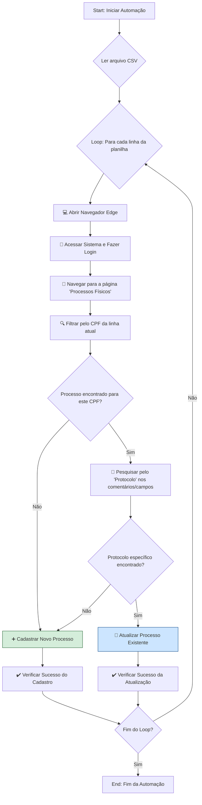

# 🤖 Automação para Inserção e Atualização de Processos

## 🎯 Visão Geral

Esta é uma automação desenvolvida para testar e realizar a inserção e atualização de processos no sistema da diretoria da instituição.

O fluxo de trabalho consiste em extrair dados do nosso sistema interno (regional) via SQL, exportá-los para um arquivo CSV e, em seguida, executar este script para sincronizar e atualizar as informações no sistema nacional da diretoria.

> **Nota:** Sim, utilizamos dois sistemas diferentes para controlar a mesma informação. Esta automação serve como uma ponte para manter a consistência entre a base de dados local (regional) e a nacional.

-----

## 🏛️ Arquitetura da Sincronização

O diagrama abaixo ilustra o fluxo de dados entre os sistemas e como a automação se encaixa no processo.

```mermaid
graph LR
    subgraph "Ambiente Regional"
        A[Sistema Interno<br>(Banco de Dados SQL)]
    end
    subgraph "Processo de Extração"
        B(Exportação<br>de Dados)
    end
    subgraph "Automação"
        C[📄<br>Arquivo CSV]
        D[🤖<br>Script de Automação]
    end
    subgraph "Ambiente Nacional"
        E[Sistema da Diretoria<br>(Interface Web)]
    end

    A -- "1. Extração via SQL" --> B;
    B -- "2. Gera o arquivo" --> C;
    C -- "3. Lido por" --> D;
    D -- "4. Interage e atualiza" --> E;

    style D fill:#fcf8e3,stroke:#8a6d3b
```

-----

## ⚙️ Fluxograma do Processo

Este fluxograma detalha, passo a passo, a lógica executada pelo script para cada registro do arquivo CSV.



-----

## 🤔 Observação Importante: A Lógica de Busca

Antes que você se pergunte por que a filtragem/busca não é feita diretamente pelo **protocolo**, há um motivo técnico importante.

No sistema da diretoria, o campo `protocolo` não foi implementado como chave primária. Na verdade, ele só foi adicionado como um campo de texto livre após uma solicitação direta, pois, sem uma chave primária, é impossível garantir a atualização correta e segura dos dados.

Imagine o seguinte cenário:

  * Uma pessoa (identificada por um CPF) pode dar entrada em vários processos na mesma data.
  * Esses processos podem ser para a mesma atividade.
  * Todos eles podem estar no mesmo status (ex: "em análise").

Neste caso, a única forma de diferenciar um processo do outro seria através de um identificador único, que obviamente deveria ser o protocolo. Por causa dessa limitação, foi necessário criar a lógica detalhada no fluxograma acima.

## ⚠️ Pré-requisitos

**LEMBRE-SE DE BAIXAR O WEBDRIVER PARA O MICROSOFT EDGE**

Para que a automação possa controlar o navegador Edge, é essencial ter o driver correspondente à sua versão do navegador.

➡️ **Link para Download:** [Microsoft Edge WebDriver](https://developer.microsoft.com/en-us/microsoft-edge/tools/webdriver/?form=MA13LH#downloads)
